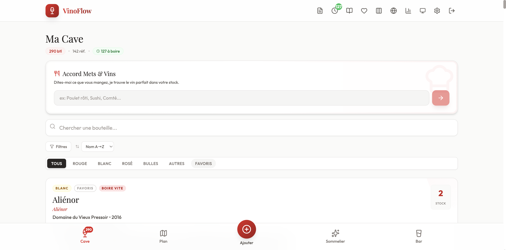
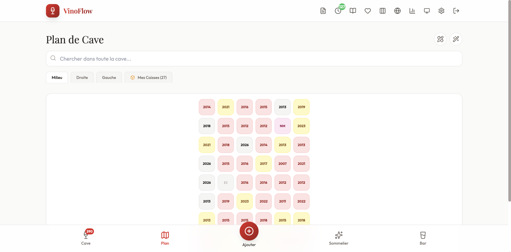
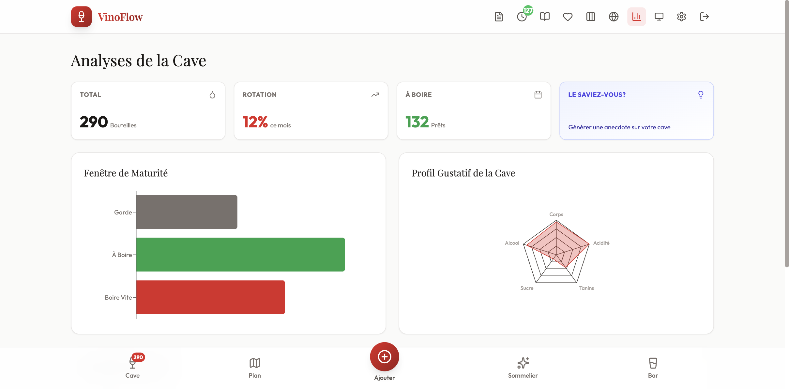
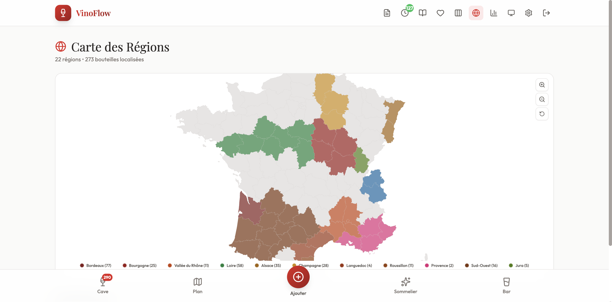
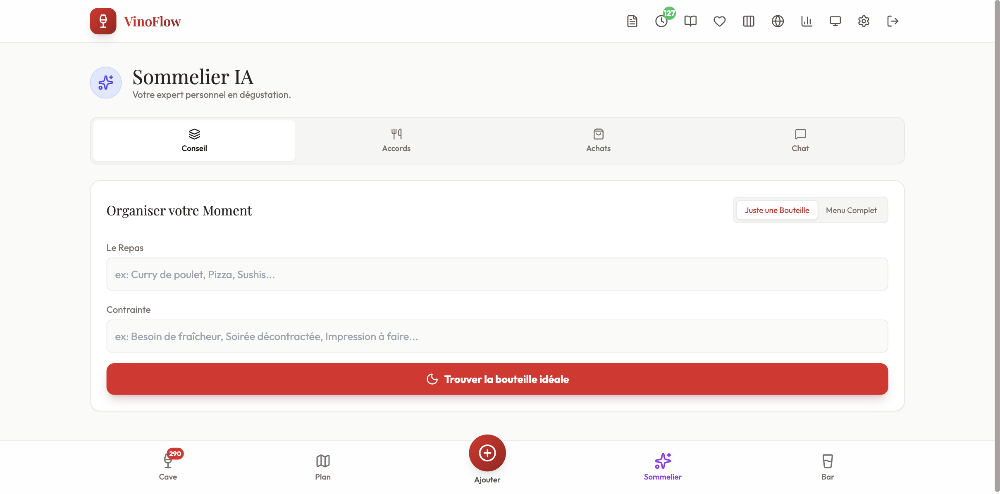

<div align="center">

# 🍷 VinoFlow

**Your self-hosted wine cellar & bar management app**

Modern, AI-powered wine cellar management with tasting notes, cocktail recipes, and sommelier recommendations.

[Features](#features) · [Installation](#installation) · [Configuration](#configuration) · [Screenshots](#screenshots) · [License](#license)

</div>

---

## Features

- **Wine Cellar** — Add, edit, and organize your wine collection
- **Visual Cellar Map** — Drag & drop bottles on customizable rack layouts
- **Bar & Spirits** — Manage your spirits collection with cocktail suggestions
- **Tasting Notes** — Record tasting notes with flavor radar charts
- **AI Sommelier** — Get food pairing and wine recommendations powered by Gemini AI
- **Analytics** — Stats, charts, and insights about your collection
- **Region Map** — Visualize where your wines come from
- **Wine Comparison** — Compare wines side by side
- **Drink Now** — Suggestions for wines at peak drinking window
- **Cellar Journal** — Track additions, removals, and cellar activity
- **Wishlist** — Keep track of wines you want to buy
- **Dark Mode** — Full dark theme support
- **Mobile Friendly** — Responsive design, works on phone and tablet

## Tech Stack

- **Frontend**: React 19 + TypeScript + Tailwind CSS + Vite
- **Backend**: Node.js + Express
- **Database**: PostgreSQL
- **AI**: Google Gemini (optional)
- **Deploy**: Docker + Nginx

## Installation

### Prerequisites

- Docker & Docker Compose

### Quick Start

```bash
# 1. Clone the repo
git clone https://github.com/xener86/VinoFlow.git
cd VinoFlow

# 2. Create your config
cp .env.example .env
# Edit .env with your own passwords

# 3. Start
docker compose up -d
```

VinoFlow is now running at **http://localhost:5001**

## Configuration

### Environment Variables

Copy `.env.example` to `.env` and customize:

| Variable | Description | Required |
|----------|-------------|----------|
| `POSTGRES_USER` | Database username | Yes |
| `POSTGRES_PASSWORD` | Database password | Yes |
| `POSTGRES_DB` | Database name | Yes |
| `DATABASE_URL` | Full PostgreSQL connection string | Yes |
| `JWT_SECRET` | Secret for JWT tokens | Yes |
| `VINOFLOW_PORT` | Frontend port (default: 5001) | No |

### Gemini AI (Optional)

The AI Sommelier feature uses Google Gemini. You can configure the API key directly in the app's **Settings** page — no environment variable needed.

Get a free API key at [Google AI Studio](https://aistudio.google.com/apikey).

### Reverse Proxy

To expose VinoFlow with HTTPS, use a reverse proxy (Traefik, Caddy, Nginx Proxy Manager...) pointing to port `5001`.

## Screenshots

| Dashboard | Cellar Map |
|:---------:|:----------:|
|  |  |

| Analytics | Region Map |
|:---------:|:----------:|
|  |  |

| AI Sommelier |
|:------------:|
|  |

## Contributing

Contributions are welcome! Feel free to open issues or submit pull requests.

## License

This project is free for personal and non-commercial use. Commercial use requires prior authorization. See the [LICENSE](LICENSE) file for details.

---

<div align="center">
Made with ❤️ and 🍷 by <a href="https://github.com/xener86">xener86</a>
</div>
