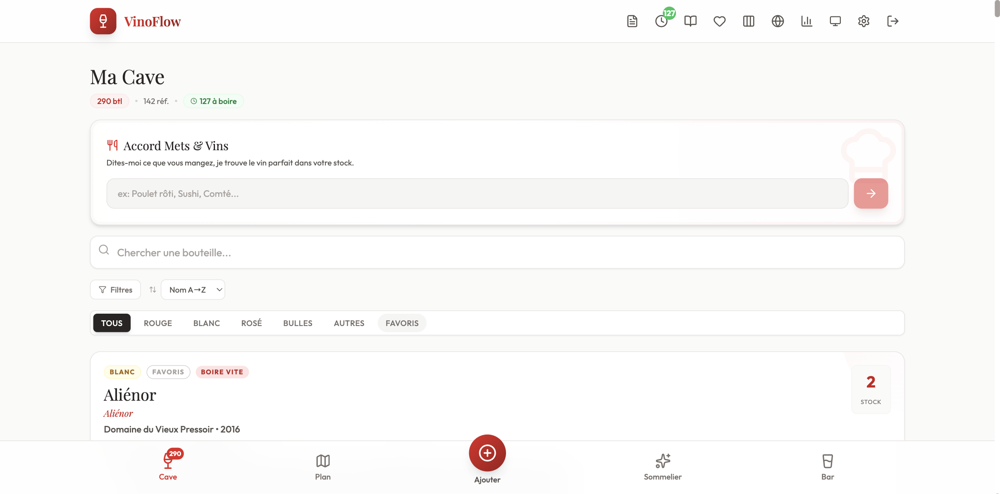
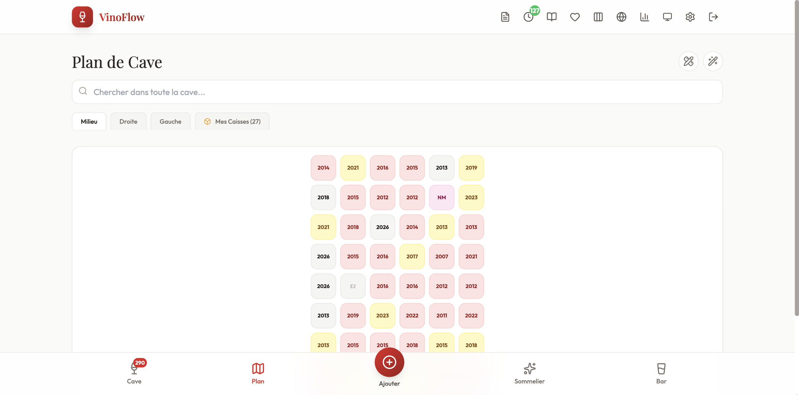
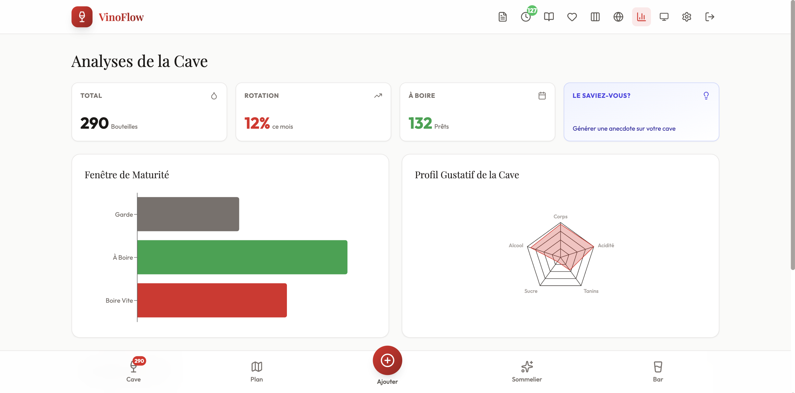
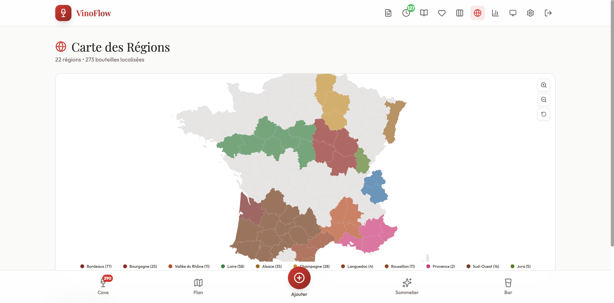
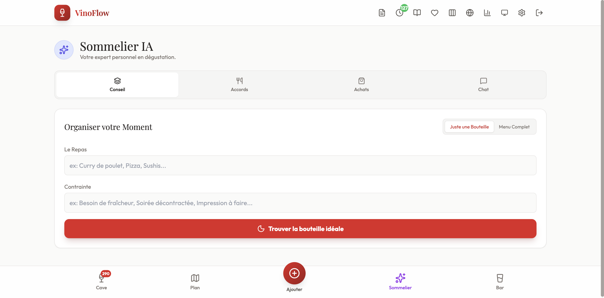

<div align="center">

# 🍷 VinoFlow

**Your self-hosted wine cellar & bar management app**

Modern, AI-powered wine cellar management with tasting notes, cocktail recipes, and sommelier recommendations — with a "Cockpit" interface and an MCP server to manage your cellar from Claude.

[](https://github.com/xener86/VinoFlow/actions/workflows/ci.yml)
[](LICENSE)

[Features](#features) · [Installation](#installation) · [Configuration](#configuration) · [Screenshots](#screenshots) · [License](#license)

</div>

---

## Features

- **Cockpit** — Dashboard, unified cellar view (List / Plan / Insights), command palette (⌘K)
- **Wine Cellar** — Add, edit, and organize your wine collection
- **Visual Cellar Map** — Drag & drop bottles on customizable rack layouts
- **Bar & Spirits** — Manage your spirits collection with cocktail suggestions
- **Tasting Notes** — Record tasting notes with flavor radar charts
- **AI Sommelier** — Food pairing, menus, verticals and comparisons powered by Gemini and/or Claude
- **Peak Windows** — AI-computed drinking windows per wine
- **Analytics** — Stats, charts, and insights about your collection
- **Region Map** — Visualize where your wines come from
- **Wine Comparison** — Compare wines side by side
- **Drink Now** — Suggestions for wines at peak drinking window
- **Cellar Journal** — Track additions, removals, and cellar activity
- **Wishlist** — Keep track of wines you want to buy
- **Mobile Friendly** — Responsive design, installable as a PWA with bottom navigation
- **MCP Server** — Query and manage your cellar from Claude or any MCP client

## Tech Stack

- **Frontend**: React 19 + TypeScript + Tailwind CSS + Vite
- **Backend**: Node.js + Express
- **Database**: PostgreSQL + pgvector
- **AI**: Google Gemini and/or Anthropic Claude (optional)
- **MCP**: TypeScript server (`mcp-server/`)
- **Deploy**: Docker + Nginx

## Installation

### Prerequisites

- Docker & Docker Compose

### Quick Start

```bash
# 1. Clone the repo
git clone https://github.com/xener86/VinoFlow.git
cd VinoFlow

# 2. Create your config
cp .env.example .env
# Edit .env and set a strong POSTGRES_PASSWORD and JWT_SECRET

# 3. Generate a strong JWT secret
openssl rand -base64 48

# 4. Start
docker compose up -d
```

VinoFlow is now running at **http://localhost:5001**. Create an account and you're good to go.

## Configuration

### Environment Variables

Copy `.env.example` to `.env` and customize:

| Variable | Description | Required |
|----------|-------------|----------|
| `POSTGRES_USER` | Database username | Yes |
| `POSTGRES_PASSWORD` | Database password | Yes |
| `POSTGRES_DB` | Database name | Yes |
| `DATABASE_URL` | Full PostgreSQL connection string | Yes |
| `JWT_SECRET` | Secret for JWT tokens — generate with `openssl rand -base64 48` | Yes |
| `FRONTEND_URL` | Public URL of your frontend (used for CORS) | Yes |
| `VINOFLOW_PORT` | Frontend port (default: 5001) | No |

### AI Providers (Optional)

The AI Sommelier works with **Google Gemini**, **Anthropic Claude**, or both. By default Gemini extracts criteria and Claude writes the argumentation; if only one provider is configured, VinoFlow falls back to it for every task.

Set the keys either in `.env` (`GEMINI_API_KEY`, `ANTHROPIC_API_KEY`) or directly in the app's **Settings** page. Per-task overrides (`VINOFLOW_PROVIDER_*`) are documented in `.env.example`.

- Gemini: [Google AI Studio](https://aistudio.google.com/apikey)
- Claude: [Anthropic Console](https://console.anthropic.com/)

### MCP Server (Optional)

`mcp-server/` exposes your cellar to Claude Desktop / Claude Code (inventory, search, sommelier pairing, drink-before alerts, consume a bottle…).

```bash
cd mcp-server && npm install && npm run build
```

Then register `node /path/to/VinoFlow/mcp-server/dist/index.js` as an MCP server with these environment variables:

| Variable | Description |
|----------|-------------|
| `VINOFLOW_API_URL` | Backend API URL (default `http://localhost:3100/api`) |
| `VINOFLOW_AUTH_TOKEN` | A JWT from your VinoFlow session (`auth_token` in the browser's localStorage) — expires after 30 days |

### Reverse Proxy

To expose VinoFlow with HTTPS, use a reverse proxy (Traefik, Caddy, Nginx Proxy Manager...) pointing to port `5001`. Make sure to set `FRONTEND_URL` in `.env` to your public URL so CORS works correctly.

## Updating

```bash
cd VinoFlow
git pull
docker compose up -d --build
```

Your database is persisted in a Docker volume, so updates won't lose your data.

## Backup & Restore

### Backup

```bash
# Dump the database to a file (replace vinoflow with your POSTGRES_DB)
docker compose exec -T db pg_dump -U vinoflow vinoflow > vinoflow-backup-$(date +%Y%m%d).sql
```

### Restore

```bash
# Restore from a backup file
cat vinoflow-backup-YYYYMMDD.sql | docker compose exec -T db psql -U vinoflow vinoflow
```

Schedule regular backups with cron if you care about your data. The Postgres volume is named `vinoflow_vinoflow-db` and can be backed up directly too.

## Troubleshooting

### `docker compose up` fails with `JWT_SECRET is missing or insecure`

The backend refuses to start with a default or missing JWT secret. Generate a real one:

```bash
openssl rand -base64 48
```

Set it in your `.env` and restart: `docker compose up -d`.

### API calls return 401 Unauthorized

Your session token is invalid or expired. Log out and back in.

### API calls return 502 Bad Gateway

The backend is not ready yet. Wait a few seconds after startup, or check logs: `docker compose logs backend`.

### White screen on first load

Make sure `FRONTEND_URL` in `.env` matches the URL you're using in your browser. The backend's CORS policy blocks unknown origins.

### Check the logs

```bash
docker compose logs -f           # all services
docker compose logs -f backend   # backend only
docker compose logs -f db        # database only
```

### Reset everything (destructive)

```bash
docker compose down -v           # removes containers AND the database volume
docker compose up -d              # fresh install
```

## Screenshots

| Dashboard | Cellar Map |
|:---------:|:----------:|
|  |  |

| Analytics | Region Map |
|:---------:|:----------:|
|  |  |

| AI Sommelier |
|:------------:|
|  |

## Contributing

Contributions are welcome! Feel free to open issues or submit pull requests.

## License

This project is free for personal and non-commercial use. Commercial use requires prior authorization. See the [LICENSE](LICENSE) file for details.

---

<div align="center">
Made with ❤️ and 🍷 by <a href="https://github.com/xener86">xener86</a>
</div>
