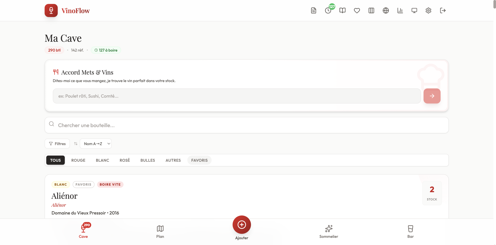
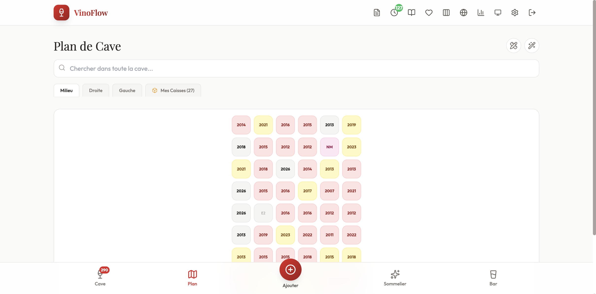
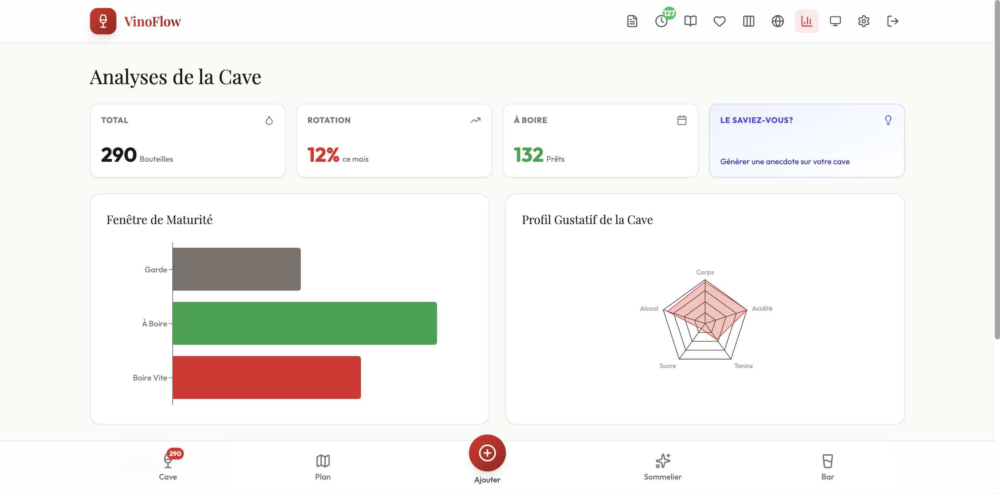
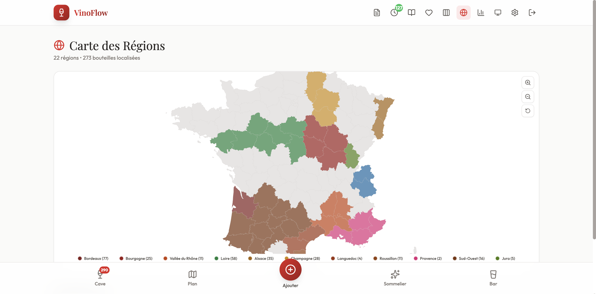
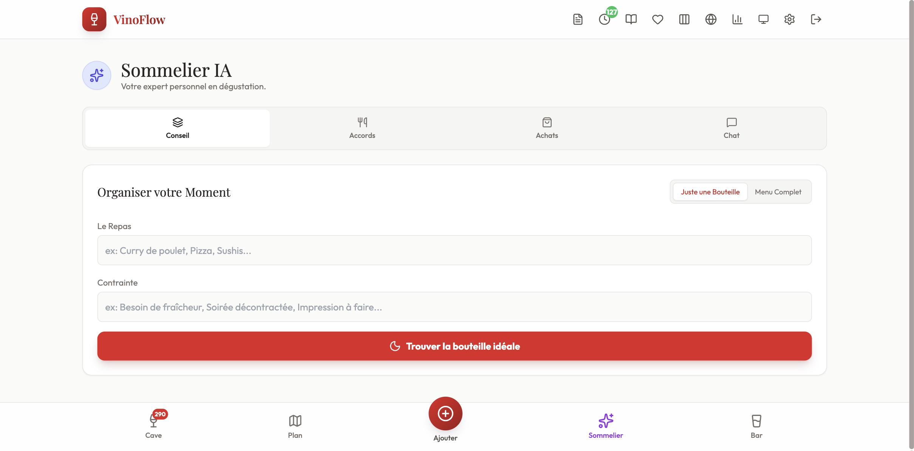

<div align="center">

# 🍷 VinoFlow

**Your self-hosted wine cellar & bar management app**

Modern, AI-powered wine cellar management with tasting notes, cocktail recipes, and sommelier recommendations — with a "Cockpit" interface and an MCP server to manage your cellar from Claude.

[](https://github.com/xener86/VinoFlow/actions/workflows/ci.yml)
[](LICENSE)

[Features](#features) · [Installation](#installation) · [Configuration](#configuration) · [Screenshots](#screenshots) · [License](#license)

</div>

---

## Features

- **Cockpit** — Dashboard, unified cellar view (List / Plan / Insights), command palette (⌘K)
- **Wine Cellar** — Add, edit, and organize your wine collection
- **Visual Cellar Map** — Drag & drop bottles on customizable rack layouts
- **Bar & Spirits** — Manage your spirits collection with cocktail suggestions
- **Tasting Notes** — Record tasting notes with flavor radar charts
- **AI Sommelier** — Food pairing, menus, verticals and comparisons powered by Gemini and/or Claude
- **Peak Windows** — AI-computed drinking windows per wine
- **Analytics** — Stats, charts, and insights about your collection
- **Region Map** — Visualize where your wines come from
- **Wine Comparison** — Compare wines side by side
- **Drink Now** — Suggestions for wines at peak drinking window
- **Cellar Journal** — Track additions, removals, and cellar activity
- **Wishlist** — Keep track of wines you want to buy
- **Mobile Friendly** — Responsive design, installable as a PWA with bottom navigation
- **MCP Server** — Query and manage your cellar from Claude or any MCP client

## Tech Stack

- **Frontend**: React 19 + TypeScript + Tailwind CSS + Vite
- **Backend**: Node.js + Express
- **Database**: PostgreSQL + pgvector
- **AI**: Google Gemini and/or Anthropic Claude (optional)
- **MCP**: TypeScript server (`mcp-server/`)
- **Deploy**: Docker + Nginx

## Installation

### Prerequisites

- Docker & Docker Compose

### Quick Start

```bash
# 1. Clone the repo
git clone https://github.com/xener86/VinoFlow.git
cd VinoFlow

# 2. Create your config
cp .env.example .env
# Edit .env and set a strong POSTGRES_PASSWORD and JWT_SECRET

# 3. Generate a strong JWT secret
openssl rand -base64 48

# 4. Start
docker compose up -d
```

VinoFlow is now running at **http://localhost:5001**. The first account can always be created (bootstrap); after that, sign-ups are closed unless `ALLOW_SIGNUP=true` (see [Accounts & household model](#accounts--household-model)).

## Accounts & household model

**VinoFlow is a shared household cellar, not a multi-tenant app.** Every account sees and edits the same wines, bottles, racks, spirits, tasting notes, journal and wishlist — there is no per-user isolation, by design. Only a few things are personal: sommelier feedback / taste profile, and who added a bottle.

Consequences:

- Anyone with an account has full read/write access to the whole cellar. Only create accounts for people you would hand the cellar keys to.
- Sign-ups are **closed by default** (`ALLOW_SIGNUP=false`). The very first account of a fresh install is always allowed. To add a household member: set `ALLOW_SIGNUP=true`, `docker compose up -d`, let them sign up, then set it back to `false`.
- Don't expose VinoFlow to the internet without HTTPS (reverse proxy) — and keep sign-ups closed if you do.

## Security

- **Sessions** — short-lived access token (15 min, JWT) + opaque refresh token (30 days, stored hashed in `refresh_tokens`, rotated on every use). Logout revokes the session; changing or resetting a password revokes every session of the account. Reusing an already-rotated refresh token revokes the whole session (theft detection).
- **Passwords** — 10 characters minimum, bcrypt cost 12 (older hashes are upgraded on next login).
- **Password reset** — "Mot de passe oublié ?" on the login page sends a single-use link valid for 1 hour (token stored hashed). The response is identical whether the email exists or not. Also: *Paramètres → Mon compte → Changer mon mot de passe*.
- **Rate limiting** — `/api/auth/*`: 20 requests / 15 min / IP (refresh: 60). Costly AI routes (`/api/sommelier/*`, `enrich-aromas`, `refresh-peaks`, `bulk-set-peaks`, `extract-from-image`, `refresh-embeddings`): 60 requests / 15 min / user. If another reverse proxy sits in front of VinoFlow's nginx, set `TRUST_PROXY=2` so the real client IP is used.
- **Headers** — `helmet` on the API, `nosniff` / `X-Frame-Options: DENY` / `Referrer-Policy` / minimal CSP on the frontend (nginx). Add HSTS on your TLS reverse proxy.
- **AI keys in the browser** — keys typed in *Paramètres* are stored in the browser's `localStorage` (readable by any injected script) and sent to the backend in `x-vinoflow-*-key` headers as a fallback when the server has no key. Server env vars always take precedence. Prefer env vars, use keys with a spending cap, and set `ALLOW_CLIENT_AI_KEYS=false` to make the backend ignore browser keys.

## Configuration

### Environment Variables

Copy `.env.example` to `.env` and customize:

| Variable | Description | Required |
|----------|-------------|----------|
| `POSTGRES_USER` | Database username | Yes |
| `POSTGRES_PASSWORD` | Database password | Yes |
| `POSTGRES_DB` | Database name | Yes |
| `DATABASE_URL` | Full PostgreSQL connection string | Yes |
| `JWT_SECRET` | Secret for JWT tokens — generate with `openssl rand -base64 48` | Yes |
| `FRONTEND_URL` | Public URL of your frontend (used for CORS) | Yes |
| `VINOFLOW_PORT` | Frontend port (default: 5001) | No |
| `ALLOW_SIGNUP` | Allow new sign-ups (default `false`; the first account is always allowed) | No |
| `TRUST_PROXY` | Number of reverse proxies in front of the backend (default `1` = the bundled nginx) | No |
| `ALLOW_CLIENT_AI_KEYS` | Accept AI keys sent by the browser as a fallback (default `true`) | No |
| `SWEEGO_API_KEY` | [Sweego](https://www.sweego.io/) API key for password-reset emails | No |
| `MAIL_FROM` | Sender, on a domain verified in Sweego (`VinoFlow <cave@mail.example.com>`) | With Sweego |
| `APP_URL` | Public URL used in email links (default: `FRONTEND_URL`) | No |
| `BACKUP_HOUR` / `BACKUP_KEEP_DAILY` / `BACKUP_KEEP_WEEKLY` / `TZ` | Backup schedule & retention (default 3 h, 7, 4, Europe/Paris) | No |

### Email (password reset)

Password-reset emails are sent through the [Sweego](https://www.sweego.io/) API. Set `SWEEGO_API_KEY` and `MAIL_FROM` (an address on a domain verified in Sweego), plus `APP_URL` if the public URL differs from `FRONTEND_URL`.

Without `SWEEGO_API_KEY`, nothing is sent: the reset link is written to the backend logs instead (`docker compose logs backend | grep "Lien de réinitialisation"`) — handy for a single-household install.

### AI Providers (Optional)

The AI features work with **Anthropic Claude**, **Google Gemini**, or both. Each task has its own default model — Claude Haiku 4.5 for dish analysis and critique, Claude Sonnet 5.5 for pairing arguments and enrichment (with web search), Gemini Flash for label OCR, `gemini-embedding-001` for embeddings — and falls back to the other provider when the first one is missing or fails (except enrichment, which never guesses without web search). Outputs use native structured JSON on both providers.

Set the keys in `.env` (`GEMINI_API_KEY`, `ANTHROPIC_API_KEY`) — recommended — or in the app's **Settings** page (stored in the browser, see [Security](#security)). Per-task overrides (`VINOFLOW_PROVIDER_*`, `VINOFLOW_MODEL_*`, `VINOFLOW_MAX_TOKENS_*`, `VINOFLOW_EFFORT_*`) are documented in `.env.example`.

Every AI call is logged (task, model, tokens, latency, success, estimated cost) to the backend logs and the `ai_calls` table — `GET /api/ai/usage?days=30` sums it up per task and model.

After upgrading from a version that used `text-embedding-004`, recompute embeddings (old vectors are incompatible): `docker compose exec backend npm run embeddings:refresh -- --all`.

- Gemini: [Google AI Studio](https://aistudio.google.com/apikey)
- Claude: [Anthropic Console](https://console.anthropic.com/)

### MCP Server (Optional)

`mcp-server/` exposes your cellar to Claude Desktop / Claude Code (inventory, search, sommelier pairing, drink-before alerts, consume a bottle…).

```bash
cd mcp-server && npm install && npm run build
```

Then register `node /path/to/VinoFlow/mcp-server/dist/index.js` as an MCP server with these environment variables:

| Variable | Description |
|----------|-------------|
| `VINOFLOW_API_URL` | Backend API URL (default `http://localhost:3100/api`) |
| `VINOFLOW_EMAIL` / `VINOFLOW_PASSWORD` | A household account. The MCP server logs in and renews its session automatically (recommended) |
| `VINOFLOW_AUTH_TOKEN` | Legacy: a fixed access token. Access tokens now expire after 15 minutes, so use email/password instead |

### Reverse Proxy

To expose VinoFlow with HTTPS, use a reverse proxy (Traefik, Caddy, Nginx Proxy Manager...) pointing to port `5001`. Make sure to set `FRONTEND_URL` in `.env` to your public URL so CORS works correctly.

## Updating

```bash
cd VinoFlow
git pull
docker compose up -d --build
```

Your database is persisted in a Docker volume, so updates won't lose your data.

Database migrations are applied **automatically** when the backend starts: `db/init.sql` on an empty database, then every missing file of `db/migrations/` in order, each in its own transaction (tracked in the `schema_migrations` table). Nothing to run by hand. Watch them with `docker compose logs backend | grep Migration`.

On a database created before the migration runner, migrations already present (001-004) are detected from the schema and only recorded. If a migration fails, the backend stops (and Docker restarts it) instead of serving on an incomplete schema — check `docker compose logs backend`.

> **Upgrading to the session/refresh-token release (migration 004):** everyone is logged out once (old 30-day tokens are rejected), and the MCP server must switch to `VINOFLOW_EMAIL` / `VINOFLOW_PASSWORD`.

## Backup & Restore

### Automatic backups

The `backup` service dumps the database every day at `BACKUP_HOUR` (default 3 h, `TZ` default Europe/Paris) — and once at startup if today's dump is missing — into `./backups` on the host:

```
backups/
  daily/   vinoflow-YYYYMMDD-HHMMSS.sql.gz   ← last 7 (BACKUP_KEEP_DAILY)
  weekly/  vinoflow-YYYYMMDD-HHMMSS.sql.gz   ← Sunday copies, last 4 (BACKUP_KEEP_WEEKLY)
```

`./backups` lives next to the database on the same machine: copy it elsewhere too (NAS snapshot, rsync, restic…). Check it works with `docker compose logs backup` and `ls -lh backups/daily`.

Manual dump at any time:

```bash
docker compose exec -T db pg_dump --clean --if-exists --no-owner -U vinoflow vinoflow | gzip > vinoflow-manual-$(date +%Y%m%d).sql.gz
```

### Restore

Dumps contain `DROP … IF EXISTS` statements, so they restore over the existing database as well as into a fresh one:

```bash
# 1. Stop the app so nothing writes during the restore
docker compose stop backend

# 2. Restore (pick the dump you want)
gunzip -c backups/daily/vinoflow-YYYYMMDD-HHMMSS.sql.gz \
  | docker compose exec -T db psql -U vinoflow -d vinoflow -v ON_ERROR_STOP=1

# 3. Restart
docker compose start backend
```

All sessions issued after the dump are lost with the restore: users simply log in again.

## Troubleshooting

### `docker compose up` fails with `JWT_SECRET is missing or insecure`

The backend refuses to start with a default or missing JWT secret. Generate a real one:

```bash
openssl rand -base64 48
```

Set it in your `.env` and restart: `docker compose up -d`.

### API calls return 401 Unauthorized

The app renews sessions automatically; a 401 that sends you back to the login page means the refresh token expired (30 days of inactivity) or was revoked (logout, password change). Log in again.

### The backend keeps restarting after an update

A database migration probably failed: `docker compose logs backend | grep -i migration` shows which one and why.

### "Trop de tentatives" (HTTP 429)

Rate limit hit (see [Security](#security)). Wait 15 minutes. If it happens to everyone at once behind your own reverse proxy, set `TRUST_PROXY=2`.

### API calls return 502 Bad Gateway

The backend is not ready yet. Wait a few seconds after startup, or check logs: `docker compose logs backend`.

### White screen on first load

Make sure `FRONTEND_URL` in `.env` matches the URL you're using in your browser. The backend's CORS policy blocks unknown origins.

### Check the logs

```bash
docker compose logs -f           # all services
docker compose logs -f backend   # backend only
docker compose logs -f db        # database only
```

### Reset everything (destructive)

```bash
docker compose down -v           # removes containers AND the database volume
docker compose up -d              # fresh install
```

## Screenshots

| Dashboard | Cellar Map |
|:---------:|:----------:|
|  |  |

| Analytics | Region Map |
|:---------:|:----------:|
|  |  |

| AI Sommelier |
|:------------:|
|  |

## Contributing

Contributions are welcome! Feel free to open issues or submit pull requests.

## License

This project is free for personal and non-commercial use. Commercial use requires prior authorization. See the [LICENSE](LICENSE) file for details.

---

<div align="center">
Made with ❤️ and 🍷 by <a href="https://github.com/xener86">xener86</a>
</div>
